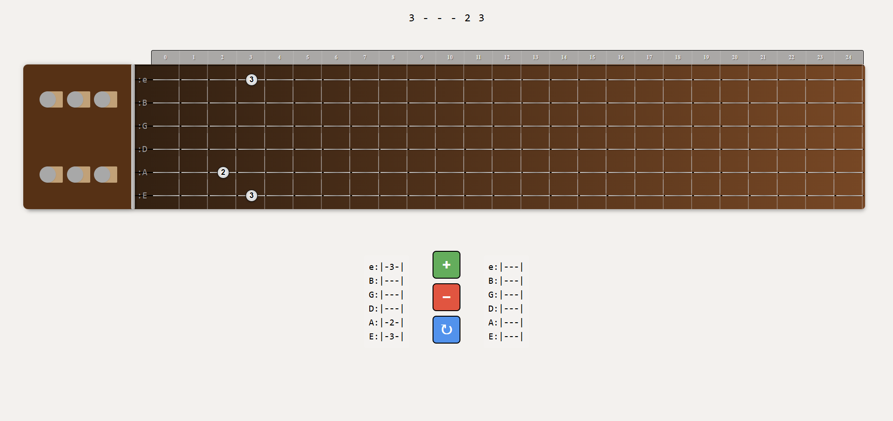

# Tabulator

## Overview
An interactive guitar tab editor. Tabulator is a Render-deployed MERN Stack application. A user may create, edit, and save guitar tabs to their profile. This editor is intended for amateur musicians looking to digitally create and customize tabs. The tabs are saved in a database and can be accessed online anywhere.

## Features
* Interactive Guitar Tab Editor & Viewer
* User Login Authentication
* CRUD Operations
* Responsive Design

## Tech Stack
* Frontend: TypescriptReact
* Backend: Node.js, Express
* Database: MongoDB (Mongoose)/GraphQL
* Authentication: JWT
* Deployment: Render

## File Structure
```
📁 Tabulator
├── 📁 client
│   ├── 📁 src
│   │   ├── 📁 components
│   │   │   ├── 📁 Footer
│   │   │   └── 📁 Header
│   │   │       ├── ButtonsBox.tsx
│   │   │       ├── DisplayTabs.tsx
│   │   │       ├── FreshNums.tsx
│   │   │       ├── LiveArray.tsx
│   │   │       ├── LiveTabs.tsx
│   │   │       ├── NeckBox.tsx
│   │   │       ├── StringBox.tsx
│   │   │       ├── TabContext.tsx
│   │   │       ├── TabProvider.tsx
│   │   ├── 📁 interfaces
│   │   │   ├── ApiMessage.tsx
│   │   │   ├── UserData.tsx
│   │   │   └── UserLogin.tsx
│   │   ├── 📁 pages
│   │   │   ├── Error.tsx
│   │   │   ├── Home.tsx
│   │   │   ├── Login.tsx
│   │   │   └── Signup.tsx
│   │   ├── 📁 utils
│   │   │   ├── auth.ts
│   │   │   ├── mutations.ts
│   │   │   └── queries.ts
│   │   ├── App.css
│   │   ├── App.tsx
│   │   ├── main.tsx
│   │   └── vite-env.d.ts
│   ├── .gitignore
│   ├── .eslintrc.cjs
│   ├── index.html
│   ├── package-lock.json
│   ├── package.json
│   ├── tsconfig.json
│   ├── tsconfig.node.json
│   ├── tsconfig.tsbuildinfo
│   └── vite.config.ts
├── 📁 server
│   ├── 📁 dist
│   ├── 📁 node_modules
│   ├── 📁 src
│   ├── package-lock.json
│   ├── package.json
│   └── tsconfig.json
├── .gitignore
└── README.md
```

## Installation
bash
```
# Clone the repo
git clone https://github.com/your-username/your-repo-name.git
cd your-repo-name

# Install frontend and backend dependencies
cd client
npm install
cd ../server
npm install

# Set up environment variables
# (list what vars are needed, like MONGO_URI, JWT_SECRET, etc.)

```

## Contributing
* Michael Davies
* Brandon Carlson
* Joel Smith
* Tanner Chamberlain

## Repository
* Github
https://github.com/michaelhdavies/tab-editor
* Render

## Screenshot

## License
MIT License
## Contact
* https://github.com/Joelogical
* https://github.com/carlbr3
* https://github.com/dattanmando
* https://github.com/michaelhdavies